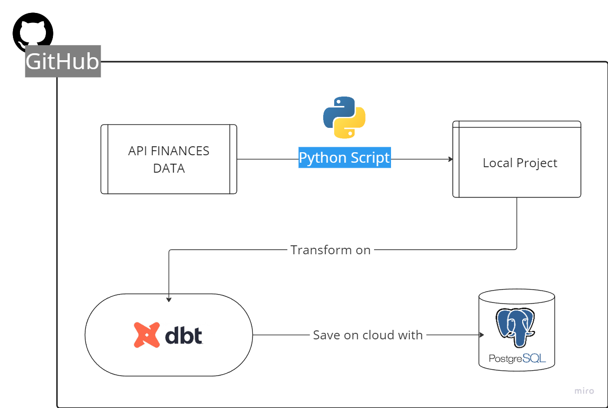

# Commodities - API Python + DBT + Postgres

## Introduction
The objective of this project is to create a simple ETL to get data from commodities prices traded on global stock market, transform using DBT and store in a Postgres SQL. 

